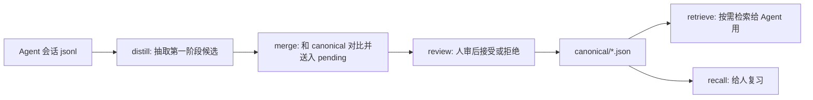

# init

这个 skill 是整个知识库工作区的入口。它先把运行环境补齐，再给用户说明这套 skill 如何协作。

它不抽取知识、不审核 pending、不改写 canonical 内容、不替用户做合并判断。

## 这套 skill 做什么

这套工作区把 Agent 会话里值得长期复用的知识，从原始对话推进到可检索、可复习的知识库：



五个业务 skill 的分工：

| skill | 负责什么 | 不负责什么 |
|---|---|---|
| `distill` | 从 Claude Code / Codex 主会话增量抽取第一阶段候选 | 不读 canonical，不做 duplicate/update/link 判类 |
| `merge` | 把 stage1 候选和 canonical 对比，写入 pending 或 duplicates | 不做人审，不改 canonical |
| `review` | 启动本地审核 UI，按用户操作接受、拒绝、编辑 | 不调用模型，不重新判类 |
| `retrieve` | 从已审核 canonical 中按索引和 id 读取知识 | 不全量注入上下文，不写 canonical |
| `recall` | 给人做文本复习和反馈调度 | 不改知识正文 |

## 初始化内容

默认初始化会补齐：

- `knowledge/canonical/`
- `knowledge/distill_stage1.json`
- `knowledge/pending.json`
- `knowledge/duplicates.json`
- `knowledge/rejected.json`
- `knowledge/history.json`
- `knowledge/whitelist.yaml`
- `knowledge/review_state.json`
- `knowledge/review_log.jsonl`
- `knowledge/agent_index.md`
- `knowledge/agent_views/*.md`

默认领域白名单只在 `whitelist.yaml` 不存在时写入：

```yaml
domains:
  - blockchain
  - ai
  - writing
  - system
  - life
```

如果文件已经存在，初始化脚本不覆盖。已有 JSON 文件如果不是对象，脚本会停止并报错，避免把损坏或异常数据静默重写。

## 命令

标准初始化：

```bash
python3 .agents/skills/init/scripts/init.py \
  --workspace "$PWD" \
  --knowledge-dir "$PWD/knowledge"
```

只检查会做什么、不写文件：

```bash
python3 .agents/skills/init/scripts/init.py \
  --workspace "$PWD" \
  --knowledge-dir "$PWD/knowledge" \
  --dry-run
```

安装 review 前端依赖并构建：

```bash
python3 .agents/skills/init/scripts/init.py \
  --workspace "$PWD" \
  --knowledge-dir "$PWD/knowledge" \
  --install-review-deps \
  --build-review-ui
```

只补齐 knowledge，不碰前端和索引：

```bash
python3 .agents/skills/init/scripts/init.py \
  --workspace "$PWD" \
  --knowledge-dir "$PWD/knowledge" \
  --skip-index \
  --skip-review-check
```

## 执行协议

1. 解析工作区，默认当前目录。
2. 运行初始化脚本；除非用户明确要求安装依赖，否则不要自动跑 `npm install` / `npm ci`。
3. 如果脚本提示缺 review 前端依赖，且用户要启动审核 UI，再征得用户同意后用 `--install-review-deps --build-review-ui`。
4. 如果 review 前端构建产物缺失且依赖已存在，标准初始化会尝试本地构建；如果要强制重建，运行 `--build-review-ui`。
5. 初始化完成后，用下面的“完成后说明”向用户解释这套 skill 的推荐用法。

## 完成后说明

初始化完成后，告诉用户：

- 日常入口通常是 `distill`：选择 Claude Code 或 Codex 主会话，抽取新候选。
- `distill` 完成后会交给 `merge`：把候选判为 duplicate / update / link / none，并写入 pending 或 duplicates。
- 要做人审时用 `review`：启动本地 UI，接受后进入 `canonical/*.json`，拒绝后进入 `rejected.json`。
- Agent 需要调用知识时用 `retrieve`：先查索引，再按 id 读取具体条目。
- 人要复习已审核知识时用 `recall`：它只写复习状态，不改知识正文。

提醒用户两个边界：

- `knowledge/` 是项目数据；skill 目录只放说明、脚本、测试和前端代码。
- `canonical/*.json` 是最终知识源；`agent_index.md` 和 `agent_views/*.md` 都是可重建的派生产物。
