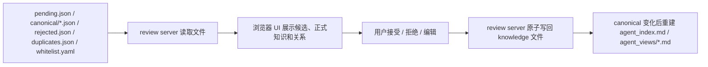
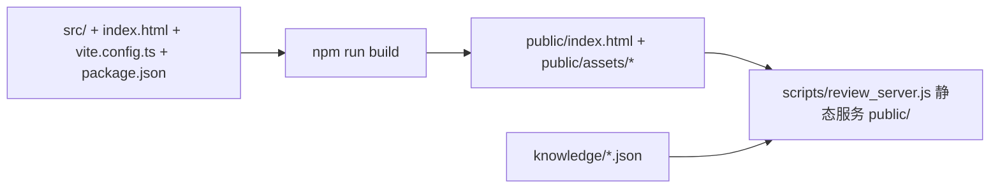

# review

把 `knowledge/pending.json` 里的待审候选渲染成可视化审核界面，并在用户拍板后写入 `canonical/<domain>.json` 或 `rejected.json`。

边界：



本 skill 不抽取会话、不调用 LLM、不重新判定 `update/link/none`，不运行 `distill` 或 `merge`。它只消费 AIDA / merge 已经写入的字段。

## 前端实现

前端使用 Material UI（基于 Google Material Design 的 React 组件库）重构，源码与构建产物分开：



如果只启动审核 UI，不需要重新构建；只有修改 `src/`、`index.html`、`vite.config.ts` 后才运行 `npm run build`。

## 文件

- 后端脚本：`scripts/review_server.js`
- 索引脚本：`scripts/build_agent_index.js`
- 前端源码：`src/`、`index.html`、`vite.config.ts`、`package.json`
- 前端构建产物：`public/index.html`、`public/assets/*`
- 项目知识目录：`$CWD/knowledge`
- 读取：`pending.json`、`canonical/*.json`、`duplicates.json`、`rejected.json`、`whitelist.yaml`
- 写入：`pending.json`、`canonical/*.json`、`rejected.json`
- 派生索引产物：`agent_index.md`、`agent_views/*.md`

不要把项目知识库放进 skill 目录；skill 目录只放 UI 和服务脚本。

## 硬规则

- 只使用现有 schema 字段展示和写回知识内容；不要让 AI 生成新知识字段。
- UI 临时状态（筛选、选中项、展开状态、操作 mode）不能写入知识文件。
- 后端不调用模型、不改写文本含义，只做用户明确触发的文件转移和字段更新。
- `m1_judgment` 是 AIDA / merge 已经给出的自动判类，审核页必须直接展示。
- `relations` 是独立的关系建议层；即使 `m1_judgment=none`，也要展示 `pending → pending` 的“建议一起审核”关系。
- `duplicate` 默认不在 pending 审核流中；如有留档，只作为统计或只读查看。
- 接受 `none/link/update` 路径 A 时，生成正式数字 id，写入 `canonical/<domain>.json`，并从 pending 删除。
- 接受 `update` 路径 B 时，只能覆盖旧 canonical 的 `title / abstract / agent / human` 四个字段；旧条 `id / source / domain / form` 保留。
- 首版不把 `target=pending` 的 relation 写入 canonical，避免正式库引用临时 `p_*` id。
- 候选入库后，剩余 pending 中指向该候选的 `target=pending` relation 要改指向新 canonical id；候选被拒绝后，剩余 pending 中指向它的 relation 要移除。
- 写文件必须走后端原子写入，不能让前端直接写本地文件。
- `agent_index.md` 和 `agent_views/*.md` 是 canonical 的派生产物，不是 source；索引失败不能回滚 canonical 写入。
- 只有 `POST /api/pending/:id/accept` 和 `PATCH /api/canonical/:id` 会触发索引重建；`PATCH /api/pending/:id`、`reject` 和只读接口不触发。
- `agent_index.md` 只放全局短目录；领域文件只包含 `id / title / form / abstract`，不要把完整 `agent` / `human` 正文写进索引。

## 命令

启动审核 UI：

```bash
node .agents/skills/review/scripts/review_server.js \
  --knowledge-dir "$PWD/knowledge" \
  --host 127.0.0.1 \
  --port 4177
```

只检查知识目录是否能读取：

```bash
node .agents/skills/review/scripts/review_server.js \
  --knowledge-dir "$PWD/knowledge" \
  --check
```

修改前端源码后重新构建：

```bash
cd .agents/skills/review
npm run build
```

手动重建 Agent 索引：

```bash
node .agents/skills/review/scripts/build_agent_index.js \
  --knowledge-dir "$PWD/knowledge"
```

启动后打开：

```text
http://127.0.0.1:4177
```

如果端口被占用，换一个 `--port`。

## 执行协议

1. 解析 `KNOWLEDGE_DIR`，默认使用当前项目的 `knowledge/`。
2. 运行 `--check`，确认 JSON 文件可读、目录存在。
3. 启动 `review_server.js`。
4. 把本地 URL 告诉用户。
5. 用户在浏览器里执行接受、拒绝、编辑和浏览操作。
6. 如用户要求汇报审核结果，读取 `pending.json`、`canonical/*.json`、`rejected.json` 统计数量。

## API 摘要

| 方法 | 路径 | 用途 |
|---|---|---|
| `GET` | `/api/state` | 返回 pending、canonical、duplicates、rejected、whitelist 和统计 |
| `PATCH` | `/api/pending/:id` | 修改待审候选的现有字段 |
| `POST` | `/api/pending/:id/accept` | 接受候选，支持 `accept_as_new` / `apply_update` |
| `POST` | `/api/pending/:id/reject` | 拒绝候选 |
| `PATCH` | `/api/canonical/:id` | 修改正式知识的现有字段 |

操作参数如 `mode`、`target_id` 只用于请求，不写入知识文件。
