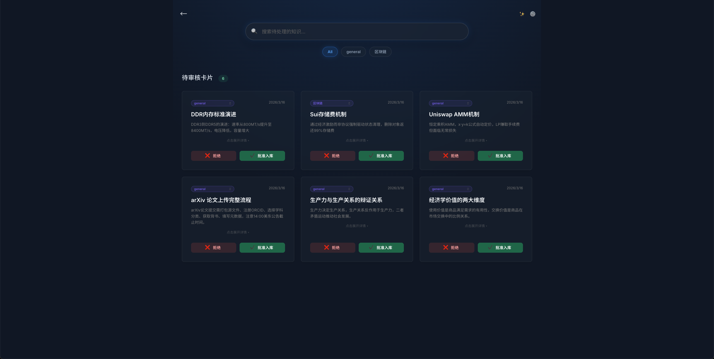
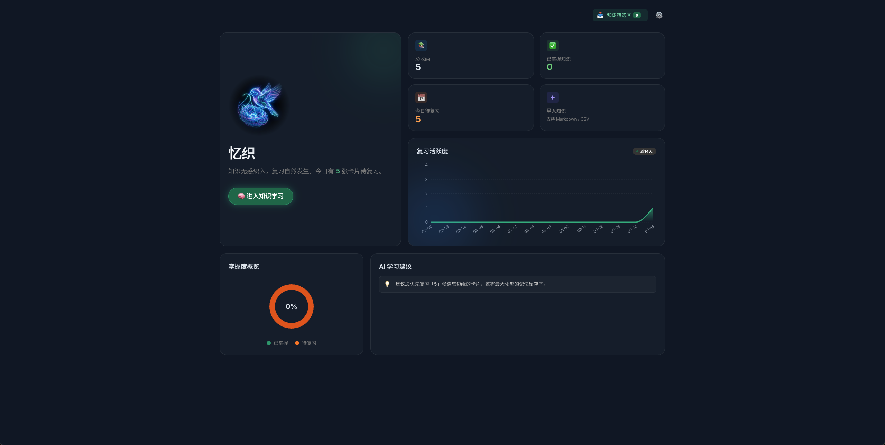
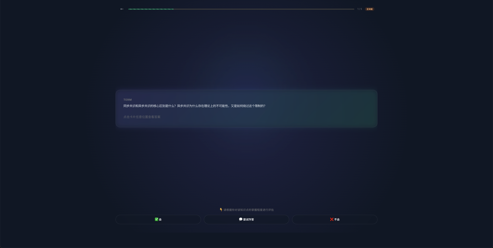
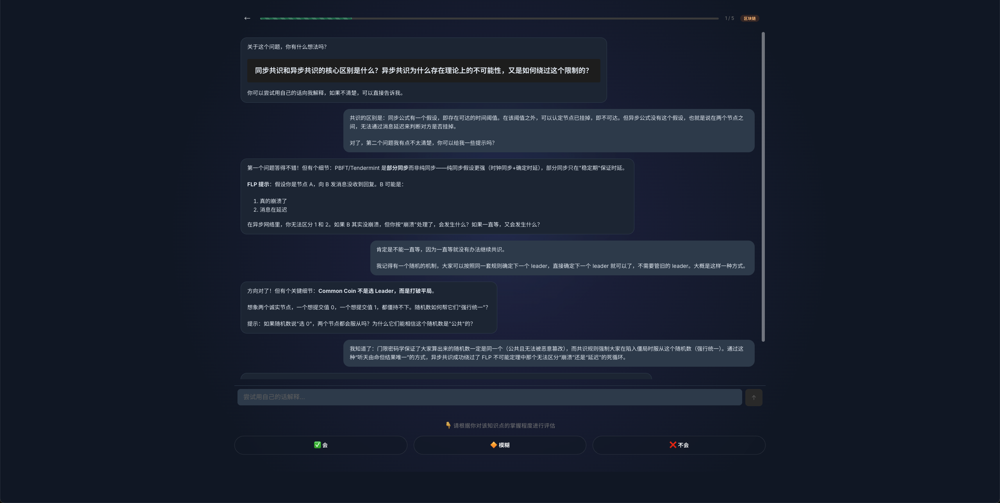
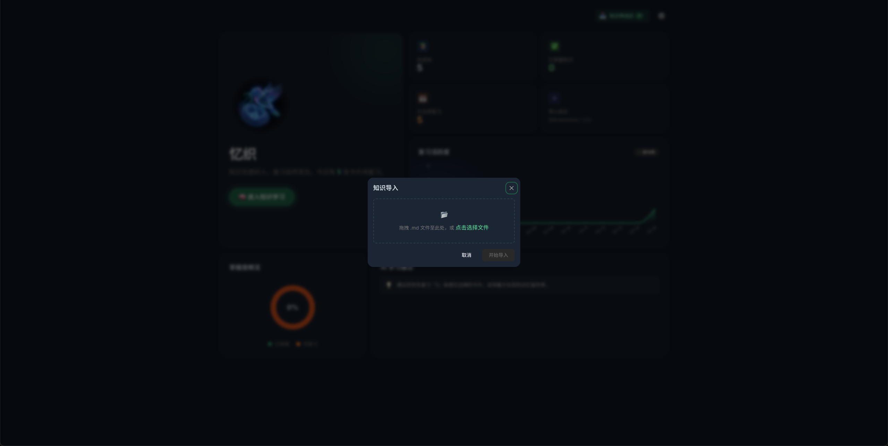
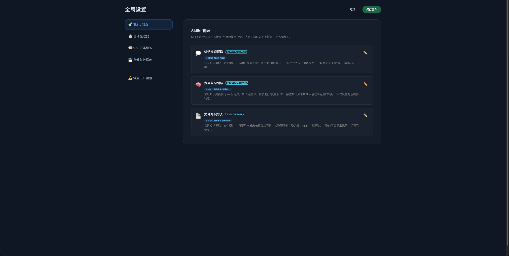

# 产品介绍

> **忆织 · Memloom** — **让每一次 AI 对话，都成为你知识的沉淀** — 基于 [OpenClaw](https://openclaw.dev) 的个人知识管理与间隔复习系统

---

## 为什么做忆织

作为一名计算机方向的博士生，我的日常主要分为两块：学术研究和写代码。这两件事都离不开 AI——每天花大量时间和 AI 对话来辅助解决问题。但我逐渐发现，**那些在对话中获得的、真正有价值的知识，最终几乎全部被遗忘了。**

阅读论文时，主线之外总会冒出一些重要的基础概念——某个技术名词或方法论的区别。顺手问了 AI，大致理解后就继续往下读了。**但并没有把这个知识记在任何地方。** 专注工作时停下来打开笔记软件整理 AI 的回答，太打断心流了。类似的概念其实三四年前就接触过，但从来没有系统地记录和巩固，每次都像新知识一样从头理解。

编程工作也一样。AI 能帮我们写代码，但多线程并发模型、数据格式转换陷阱、设计模式的权衡——这些底层原理在调试调优中反复出现。然而写代码是高度目的导向的，很少有人停下来把知识点记下来。**同样的问题反复出现：不是没接触过，而是没有收纳和消化。**

我非常希望有一款软件，能自动从 AI 对话中提取有价值的知识，整理后帮我系统复习。随着 OpenClaw 的兴起——它完全运行在本地，所有聊天记录都保存在本地文件系统——这件事终于变得可行了。于是我们基于 OpenClaw 开发了忆织。

---

## 忆织是什么

忆织（Memloom）是一款基于 OpenClaw 的 AI 个人知识管理工具。我们围绕 OpenClaw 构建了一个 TypeScript 后端插件、三个 Agent Skill，以及一个 React 可视化前端。它的核心价值在两件事：**自动化的知识整理**和**基于费曼学习法的高效复习**。

### 🤖 自动知识提取

系统按固定频率在后台自动扫描 OpenClaw 的对话记录，运用大语言模型分析对话内容，过滤闲聊和低价值信息，只提取具有核心概念和因果逻辑的知识，生成结构化的知识卡片。用户也可以在对话中通过指令主动触发提取。整个过程不打断工作，完全无感。

### 📋 知识筛选区

AI 提取的卡片不会直接入库，而是进入"知识筛选区"等待用户确认。每天花不到一分钟浏览一遍，保留有价值的、删掉不需要的即可。删除的内容会作为负样本帮助系统学习，让提取越来越精准。



### 🔄 智能间隔复习

审核通过的卡片进入知识库后，系统基于 SM-2 间隔重复算法自动追踪记忆状态，在你即将遗忘某个知识点的时候恰好安排复习。首页仪表盘展示总收纳数、已掌握数、今日待复习数和复习活跃度趋势。



### 💬 费曼对话复习

复习不是翻卡片式的死记硬背。AI 以导师角色与你展开费曼式对话：提出引导性问题、追问薄弱环节、帮你厘清逻辑链条。如果在讨论中产生了新的知识洞见，还可以一键入库，让知识库在复习中不断生长。





### 📥 多源导入

支持 Markdown 文件导入，将已有笔记一键转化为结构化知识卡片。



### ⚙️ 可视化配置

自定义知识分类体系和颜色标签、调整提取策略和复习导师风格，所有配置项均可在界面上管理。



---

# 启动教程

## 📋 前置要求

- **操作系统**：**macOS**（推荐）| Linux 理论兼容但未充分测试 | Windows 需 WSL，不保证兼容
- **Node.js** ≥ 18
- **[OpenClaw](https://openclaw.dev)** 已安装并运行

> AI 模型和 API Key 由 OpenClaw 统一管理，无需额外配置。

## 🚀 快速开始

### 下载安装（推荐）

前往 [Releases](https://github.com/Yuanyi-Ma/Memloom/releases) 页面，下载对应平台的压缩包：

- **macOS (Apple Silicon)**：`memloom-macos-arm64.tar.gz`
- **Linux (x86_64)**：`memloom-linux-x64.tar.gz`

```bash
tar xzf memloom-<平台>.tar.gz
cd memloom
bash scripts/install.sh
```

### 从源码安装

```bash
git clone https://github.com/Yuanyi-Ma/Memloom.git
cd Memloom
bash scripts/install.sh
```

> 从源码安装需要 Node.js ≥ 18，脚本会自动编译前后端。

安装脚本会自动完成：
1. ✅ 注册插件到 OpenClaw
2. ✅ 安装 Agent Skills
3. ✅ 构建项目（仅源码安装，Release 包已预编译）
4. ✅ 重启 OpenClaw Gateway

安装完成后，访问 **http://127.0.0.1:3000** 即可使用。

### 卸载

```bash
bash scripts/uninstall.sh
```

卸载脚本会移除插件注册、Skills 软链接和数据目录，不影响 OpenClaw 本身。

### 手动安装

```bash
# 1. 构建前后端
bash scripts/build.sh

# 2. 注册插件到 OpenClaw
# 在 ~/.openclaw/openclaw.json 中添加：
#   plugins.load.paths: ["<本项目绝对路径>/server"]
#   plugins.allow: ["memloom"]

# 3. 安装 Skills 软链接
ln -sfn "$(pwd)/skills/kb-active-capture" ~/.openclaw/skills/kb-active-capture
ln -sfn "$(pwd)/skills/kb-file-import" ~/.openclaw/skills/kb-file-import
ln -sfn "$(pwd)/skills/kb-feynman-review" ~/.openclaw/skills/kb-feynman-review

# 4. 重启 OpenClaw Gateway
openclaw gateway stop
openclaw gateway

# 5. 访问 http://127.0.0.1:3000
```

## 🏗️ 项目结构

```
memloom/
├── server/          # 后端 — OpenClaw 插件 (TypeScript)
│   ├── index.ts     # 插件入口：注册路由、工具、Hook、Web 服务器
│   ├── db/          # SQLite 数据库层 (better-sqlite3)
│   ├── routes/      # REST API 路由
│   ├── services/    # 业务逻辑（提取、复习排程、聚合）
│   ├── types/       # TypeScript 类型定义
│   ├── utils/       # 工具函数（配置、ID 生成）
│   └── __tests__/   # 后端测试
├── web/             # 前端 — React SPA (Vite + Mantine)
│   └── src/
│       ├── components/  # UI 组件
│       ├── routes/      # 页面（首页/知识筛选区/复习/设置/卡片列表）
│       ├── hooks/       # React Hooks
│       ├── services/    # API 调用
│       └── stores/      # Zustand 状态管理
├── skills/          # OpenClaw Agent Skills
│   ├── kb-active-capture/   # 主动知识捕获
│   ├── kb-file-import/      # 文件导入
│   └── kb-feynman-review/   # 费曼复习对话
├── scripts/         # 脚本
│   ├── install.sh   # 一键安装脚本
│   ├── uninstall.sh # 卸载脚本
│   └── build.sh     # 构建脚本
├── IMAGE/           # README 图片
├── LICENSE          # MIT License
└── README.md        # 本文件
```

## 📄 License

[MIT](./LICENSE) © Memloom Contributors

