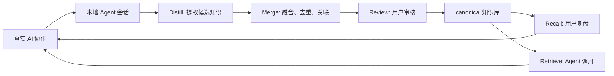

# Memloom

Memloom（织亿）是一套面向高频 AI 协作用户与本地 Agent 的双向知识系统。它从用户与 Agent 的本地会话和真实协作记录中，提取具有长期价值的知识，经融合与用户审核后，沉淀为人可复盘、Agent 可调用的长期知识层。

它要解决的不是“如何保存更多 AI 对话”，而是“如何让协作中本来会流失的知识，变成人和 Agent 共同成长的长期资产”。

## 产品定位

AI 可以越来越快地给出结果，但人的成长并不只来自结果。真正能带来长期复利的，是用户是否掌握了结果背后的概念、方法和判断方式。

Memloom 的目标是把真实协作中的高价值知识留下来：

- 对用户而言，它帮助用户从 AI 协作中提取值得学习和复盘的内容，逐步提升理解、表达、判断和驾驭 AI 的能力。
- 对 Agent 而言，它让 Agent 继承经过用户确认的长期知识，更准确地理解用户的背景、偏好、工作方式和判断标准。

这不是聊天记录归档，也不是把资料塞进向量库的传统知识库。Memloom 更关注一个长期问题：用户与 Agent 在真实协作中产生的大量经验、判断、偏好和方法，如何被持续沉淀、审核、更新，并在未来被重新使用。

## 工作流


```mermaid
flowchart LR
  A["真实 AI 协作"] --> B["本地 Agent 会话"]
  B --> C["Distill: 提取候选知识"]
  C --> D["Merge: 融合、去重、关联"]
  D --> E["Review: 用户审核"]
  E --> F["canonical 知识库"]
  F --> G["Recall: 用户复盘"]
  F --> H["Retrieve: Agent 调用"]
  G --> A
  H --> A
```

## Skill 模块

Memloom 当前由五个业务 skill 和一个初始化 skill 组成。

| skill | 作用 | 边界 |
|---|---|---|
| `distill` | 从 Claude Code / Codex 主会话中抽取长期有价值的第一阶段候选 | 不读取正式知识库，不做重复/更新/关联判类 |
| `merge` | 将第一阶段候选与已审核知识对比，写入 `pending.json` 或 `duplicates.json` | 不做人审，不改 `canonical/*.json` |
| `review` | 启动本地审核 UI，让用户接受、拒绝或编辑候选 | 不调用模型，不重新判类 |
| `retrieve` | 让 Agent 按索引和 id 读取已审核知识 | 不全量注入上下文，不写正式知识库 |
| `recall` | 帮用户复习已审核知识，并记录掌握状态 | 不改知识正文 |
| `init` | 初始化工作区、补齐依赖和生成使用引导 | 不抽取、不审核、不写入正式知识 |

## 仓库包含什么

本仓库只保存 skill 源码和安装所需文件：

- `.agents/skills/*/SKILL.md`
- Python / Node.js 脚本
- review 前端源码和 `package.json` / `package-lock.json`
- 单元测试
- 安装和使用说明

本仓库不保存：

- `knowledge/` 个人知识库数据
- `node_modules/`
- review 前端构建产物 `public/`
- 本地运行产生的临时文件

这些内容由 `init` skill 在本地初始化或构建。

## 安装

### 方式一：作为独立工作区使用

先克隆仓库，然后在这个目录里打开 Codex / Claude Code 等支持 skill 的 Agent：

```bash
git clone https://github.com/Yuanyi-Ma/Memloom.git
cd Memloom
```

然后直接对 Agent 说：

```text
使用 init skill 初始化 Memloom，安装并构建 review UI。
```

`init` skill 会负责补齐 `knowledge/`、安装 review 前端依赖、构建审核 UI、重建索引，并解释后续该如何使用 `distill / merge / review / retrieve / recall`。

### 方式二：安装到已有 Agent 工作区

如果你已经有一个 Codex / Claude Code 工作区，可以把 skill 复制进去：

```bash
git clone https://github.com/Yuanyi-Ma/Memloom.git /tmp/memloom
mkdir -p /path/to/your/workspace/.agents
rsync -a /tmp/memloom/.agents/skills /path/to/your/workspace/.agents/
cd /path/to/your/workspace
```

如果当前 Agent 会话已经能读取新的 `.agents/skills`，直接对 Agent 说：

```text
使用 init skill 初始化 Memloom，安装并构建 review UI。
```

如果 Agent 没有识别到新 skill，重启当前 Agent 会话或重新打开这个工作区后再说同一句话。

依赖要求：

- Python 3.10+
- Node.js 和 npm。只有 `review` 审核 UI 需要它们；纯抽取、融合、检索和复习脚本主要依赖 Python 标准库。
- 本地 Claude Code 或 Codex 会话记录。没有历史会话也可以先初始化，后续产生会话后再运行 `distill`。

## 初始化

用户主路径是让 Agent 调用 `init` skill，而不是手动调用 skill 内部脚本。你可以这样说：

```text
使用 init skill 初始化 Memloom。
```

或者：

```text
使用 init skill 初始化 Memloom，并安装、构建 review UI。
```

`init` 会补齐工作区结构：

- `knowledge/canonical/`
- `knowledge/distill_stage1.json`
- `knowledge/pending.json`
- `knowledge/duplicates.json`
- `knowledge/rejected.json`
- `knowledge/history.json`
- `knowledge/whitelist.yaml`
- `knowledge/review_state.json`
- `knowledge/review_log.jsonl`
- `knowledge/agent_index.md`
- `knowledge/agent_views/*.md`

### 无 Agent 环境的备用命令

如果你只是想在没有 Agent 的环境里调试，可以直接运行 `init` skill 的脚本。正常使用时不需要这样做。

只检查会做什么、不写文件：

```bash
python3 .agents/skills/init/scripts/init.py \
  --workspace "$PWD" \
  --knowledge-dir "$PWD/knowledge" \
  --dry-run
```

只初始化知识目录，不安装或构建 review UI：

```bash
python3 .agents/skills/init/scripts/init.py \
  --workspace "$PWD" \
  --knowledge-dir "$PWD/knowledge" \
  --skip-index \
  --skip-review-check
```

## 日常使用

1. 对 Agent 说：`使用 init skill 初始化 Memloom`，确认工作区和 review UI 可用。
2. 对 Agent 说：`使用 distill skill 整理最近的 Agent 会话`，从本地 Claude Code / Codex 主会话中选择要处理的会话，生成第一阶段候选。
3. `distill` 完成后会交给 `merge`，让候选进入 `pending.json` 或 `duplicates.json`。
4. 对 Agent 说：`使用 review skill 启动审核 UI`，在本地浏览器里审核候选。
5. 用户审核后，接受的知识进入 `knowledge/canonical/*.json`。
6. Agent 需要使用已审核知识时，对 Agent 说：`使用 retrieve skill 查找相关知识`。
7. 用户想复习已审核知识时，对 Agent 说：`使用 recall skill 复习知识`。

无 Agent 环境下，也可以直接启动 review server 作为备用方式：

```bash
node .agents/skills/review/scripts/review_server.js \
  --knowledge-dir "$PWD/knowledge" \
  --host 127.0.0.1 \
  --port 4177
```

打开：

```text
http://127.0.0.1:4177
```

## 数据边界

`knowledge/` 是本地个人数据，不应该提交到这个仓库。核心约定是：

- `canonical/*.json` 是正式知识源。
- `pending.json` 是待审候选。
- `duplicates.json` 是重复留档。
- `rejected.json` 是拒绝留档。
- `agent_index.md` 和 `agent_views/*.md` 是可重建的派生产物。
- `review_state.json` 和 `review_log.jsonl` 只服务人的复习调度。

## 测试

```bash
python3 -m unittest discover .agents/skills/init/tests
python3 -m unittest discover .agents/skills/distill/tests
python3 -m unittest discover .agents/skills/merge/tests
python3 -m unittest discover .agents/skills/recall/tests
python3 -m unittest discover .agents/skills/retrieve/tests
```

review 前端构建检查：

```bash
cd .agents/skills/review
npm ci
npm run build
```
